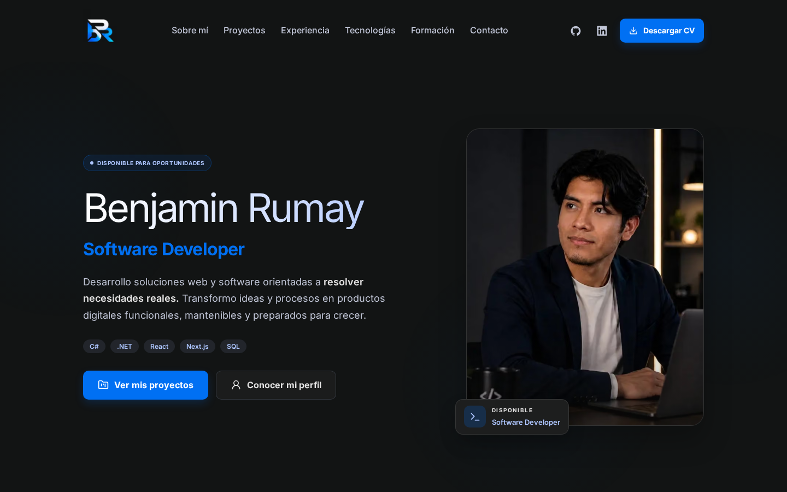

# Benjamin Rumay · Portafolio

Portafolio personal de desarrollo de software, migrado a Next.js. Recupera el diseño del portafolio original: identidad BR, Inter, títulos ligeros, retrato vertical, fondo oscuro, acentos azules y animaciones. Mantiene la arquitectura Next.js y las páginas propias de cada proyecto.



## Stack

Next.js 16 · React 19 · TypeScript strict · Tailwind CSS 4 · Lucide React · Inter local con `next/font` · `next/image`.

## Características

- Landing y cinco case studies renderizados en el servidor y generados como páginas estáticas.
- IA Cognitiva con demo en Azure y siete capturas reales.
- Scripts originales `animations.js` y `main.js` adaptados a Next.js: escritura, partículas, reveal, parallax, brillo y movimiento de tarjetas.
- Galería accesible, navegación por teclado, pausa de animaciones y movimiento reducido.
- Atrium Academy con el logo adjunto y ficha propia.
- Contacto por correo y WhatsApp sin almacenar mensajes.
- Metadata, canonical, Open Graph, JSON-LD, sitemap y headers de seguridad.
- Vitest, React Testing Library, Playwright, GitHub Actions y Dependabot.

## Ejecutar

Con Node.js 24 y npm:

```bash
npm ci
npm run dev
```

Abre `http://localhost:3000`. Para producción local: `npm run build` y `npm run start`.

## Verificar

```bash
npm run check
npx playwright install chromium
npm run test:e2e
```

Playwright compila y levanta su propio servidor de producción en el puerto 3100. En Linux, usa `npx playwright install --with-deps chromium` si faltan dependencias del navegador. Los tests no envían mensajes ni completan evaluaciones externas.

## Despliegue

Importa el repositorio en Vercel con el preset Next.js, Node.js 24, instalación `npm ci` y build `npm run build`. No requiere secretos. `SITE_URL` es opcional y debe coincidir con el dominio HTTPS definitivo. Revisa el preview y los checks antes de publicar.

La entrega incluye [guía de mantenimiento](docs/GUIA_PROYECTO.md) y [validación](docs/VALIDACION.md). Atrium Academy incorpora su identidad actual. El material de VIMOD-Academy se conserva explícitamente como antecedente; sus funciones históricas no se atribuyen a la versión actual.

No se ha definido una licencia nueva para el proyecto. Las licencias de Inter y de los SVG de marca y tecnologías se conservan junto a sus recursos.
